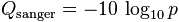
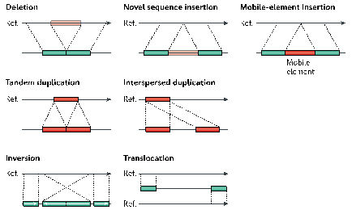
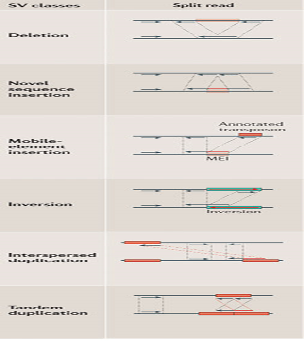

# Introduction to DNA-Seq processing
***By Mathieu Bourgey, Ph.D***

In this workshop, we will present the main steps that are commonly used to process and to analyze sequencing data. We will focus only on whole genome data and provide command lines that allow detecting Single Nucleotide Variants (SNV), for a question of time we will only present the rational for the detection of Structural Variant (SV including CNV). This workshop will show you how to launch individual steps of a complete DNA-Seq pipeline

We will be working on a 1000 genome sample, NA12878. You can find the whole raw data on the 1000 genome website:
http://www.1000genomes.org/data

For practical reasons we subsampled the reads from the sample because running the whole dataset would take way too much time and resources.

This work is licensed under a [Creative Commons Attribution-ShareAlike 3.0 Unported License](http://creativecommons.org/licenses/by-sa/3.0/deed.en_US). This means that you are able to copy, share and modify the work, as long as the result is distributed under the same license.

## Original Setup

The initial structure of your folders should look like this:
```
<ROOT>
|-- raw_reads/               # fastqs from the center (down sampled)
    `-- NA12878              # One sample directory
        |-- runERR_1         # Lane directory by run number. Contains the fastqs
        `-- runSRR_1         # Lane directory by run number. Contains the fastqs
```

### Cheat file
* You can find all the unix command lines of this practical in the file: commands.sh


### Environment setup
```
export PICARD_JAR=/usr/local/bin/picard.jar 
export SNPEFF_HOME=/usr/local/src/snpEff/  
export GATK_JAR=/usr/local/bin/GenomeAnalysisTK.jar
export BVATOOLS_JAR=/usr/local/bin/bvatools-1.4-full.jar 
export TRIMMOMATIC_JAR=/usr/local/bin/trimmomatic-0.33.jar 
export REF=/home/mBourgey/kyoto_workshop_WGS_2015/references/ 

cd $HOME 
rsync -avP /home/mBourgey/cleanCopy/ $HOME/workshop 
cd $HOME/workshop/ 
```

### Software requirements
These are all already installed, but here are the original links.

  * [Trimmomatic](http://www.usadellab.org/cms/?page=trimmomatic)
  * [BVATools](https://bitbucket.org/mugqic/bvatools/downloads)
  * [SAMTools](http://sourceforge.net/projects/samtools/)
  * [IGV](http://www.broadinstitute.org/software/igv/download)
  * [BWA](http://bio-bwa.sourceforge.net/)
  * [Genome Analysis Toolkit](http://www.broadinstitute.org/gatk/)
  * [Picard](http://picard.sourceforge.net/)
  * [SnpEff](http://snpeff.sourceforge.net/)


# First data glance
So you've just received an email saying that your data is ready for download from the sequencing center of your choice.

**What should you do ?** [solution](solutions/_data.md)


### Fastq files
Let's first explore the fastq file.

Try these commands

```
zless -S raw_reads/NA12878/runSRR_1/NA12878.SRR.33.pair1.fastq.gz

```

**Why was it like that ?** [solution](solutions/_fastq1.md)


Now try these commands:

```
zcat raw_reads/NA12878/runSRR_1/NA12878.SRR.33.pair1.fastq.gz | head -n4
zcat raw_reads/NA12878/runSRR_1/NA12878.SRR.33.pair2.fastq.gz | head -n4
```

**What was special about the output ?**

**Why was it like that?** [Solution](solutions/_fastq2.md)

You could also just count the reads

```
zgrep -c "^@SRR" raw_reads/NA12878/runSRR_1/NA12878.SRR.33.pair1.fastq.gz
```

We should obtain 15546 reads

**Why shouldn't you just do ?** 

```
zgrep -c "^@" raw_reads/NA12878/runSRR_1/NA12878.SRR.33.pair1.fastq.gz
```

[Solution](solutions/_fastq3.md)


### Quality
We can't look at all the reads. Especially when working with whole genome 30x data. You could easily have Billions of reads.

Tools like FastQC and BVATools readsqc can be used to plot many metrics from these data sets.

Let's look at the data:

```
mkdir originalQC/
java -Xmx1G -jar ${BVATOOLS_JAR} readsqc \
  --read1 raw_reads/NA12878/runSRR_1/NA12878.SRR.33.pair1.fastq.gz \
  --read2 raw_reads/NA12878/runSRR_1/NA12878.SRR.33.pair2.fastq.gz \
  --threads 2 --regionName SRR --output originalQC/

java -Xmx1G -jar ${BVATOOLS_JAR} readsqc \
  --read1 raw_reads/NA12878/runERR_1/NA12878.ERR.33.pair1.fastq.gz \
  --read2 raw_reads/NA12878/runERR_1/NA12878.ERR.33.pair2.fastq.gz \
  --threads 2 --regionName ERR --output originalQC/
```

Copy the images from the originalQC folder to your desktop and open the images.

```
scp -r <USER>@www.genome.med.kyoto-u.ac.jp:~/workshop/originalQC/ ./
```

Open the images

**What stands out in the graphs ?**
[Solution](solutions/_fastqQC1.md)

All the generated graphics have their uses. But 2 of them are particularly useful to get an overal picture of how good or bad a run went.
	- The Quality box plots 
	- The nucleotide content graphs.
	- The Box plot shows the quality distribution of your data.
 
The quality of a base is computated using the Phread quality score.
[notes](notes/_fastQC1.md) 


The quality of a base is computated using the Phread quality score.


In the case of base quality the probability use represents the probability of base to have been wrongly called


The formula outputs an integer that is encoded using an ASCII table. 

The way the lookup is done is by taking the the phred score adding 33 and using this number as a lookup in the table.

Older illumina runs were using phred+64 instead of phred+33 to encode their fastq files.


Of the raw data we see that:
 
   - Some reads have bad 3' ends.
   - Some reads have adapter sequences in them.

**Why do we see adapters in SRR ?** [solution](solutions/_adapter1.md)

Although nowadays this doesn't happen often, it does still happen. In some cases, miRNA, it is expected to have adapters.


### Trimming
Since adapter are not part of the genome they should be removed

To do that we will use Trimmomatic.
 
The adapter file is in your work folder. 

```
cat adapters.fa
```

**Why are there 2 different ones ?** [Solution](/solutions/_trim1.md)


trimming with trimmomatic:


```
mkdir -p reads/NA12878/runSRR_1/
mkdir -p reads/NA12878/runERR_1/

java -Xmx2G -cp $TRIMMOMATIC_JAR org.usadellab.trimmomatic.TrimmomaticPE -threads 2 -phred33 \
  raw_reads/NA12878/runERR_1/NA12878.ERR.33.pair1.fastq.gz \
  raw_reads/NA12878/runERR_1/NA12878.ERR.33.pair2.fastq.gz \
  reads/NA12878/runERR_1/NA12878.ERR.t20l32.pair1.fastq.gz \
  reads/NA12878/runERR_1/NA12878.ERR.t20l32.single1.fastq.gz \
  reads/NA12878/runERR_1/NA12878.ERR.t20l32.pair2.fastq.gz \
  reads/NA12878/runERR_1/NA12878.ERR.t20l32.single2.fastq.gz \
  ILLUMINACLIP:adapters.fa:2:30:15 TRAILING:20 MINLEN:32 \
  2> reads/NA12878/runERR_1/NA12878.ERR.trim.out

java -Xmx2G -cp $TRIMMOMATIC_JAR org.usadellab.trimmomatic.TrimmomaticPE -threads 2 -phred33 \
  raw_reads/NA12878/runSRR_1/NA12878.SRR.33.pair1.fastq.gz \
  raw_reads/NA12878/runSRR_1/NA12878.SRR.33.pair2.fastq.gz \
  reads/NA12878/runSRR_1/NA12878.SRR.t20l32.pair1.fastq.gz \
  reads/NA12878/runSRR_1/NA12878.SRR.t20l32.single1.fastq.gz \
  reads/NA12878/runSRR_1/NA12878.SRR.t20l32.pair2.fastq.gz \
  reads/NA12878/runSRR_1/NA12878.SRR.t20l32.single2.fastq.gz \
  ILLUMINACLIP:adapters.fa:2:30:15 TRAILING:20 MINLEN:32 \
  2> reads/NA12878/runSRR_1/NA12878.SRR.trim.out

cat reads/NA12878/runERR_1/NA12878.ERR.trim.out reads/NA12878/runSRR_1/NA12878.SRR.trim.out
```

[note on trimmomatic command](notes/_trimmomatic.md)

**What does Trimmomatic says it did ?** [Solution](solutions/_trim2.md)

Let's look at the graphs now

```
mkdir postTrimQC/
java -Xmx1G -jar ${BVATOOLS_JAR} readsqc \
  --read1 reads/NA12878/runERR_1/NA12878.ERR.t20l32.pair1.fastq.gz \
  --read2 reads/NA12878/runERR_1/NA12878.ERR.t20l32.pair2.fastq.gz \
  --threads 2 --regionName ERR --output postTrimQC/
java -Xmx1G -jar ${BVATOOLS_JAR} readsqc \
  --read1 reads/NA12878/runSRR_1/NA12878.SRR.t20l32.pair1.fastq.gz \
  --read2 reads/NA12878/runSRR_1/NA12878.SRR.t20l32.pair2.fastq.gz \
  --threads 2 --regionName SRR --output postTrimQC/
```

**How does it look now ?** [Solution](solutions/_trim3.md)


# Alignment
The raw reads are now cleaned up of artefacts we can align each lane separatly.

**Why should this be done separatly?** [Solution](solutions/_aln1.md)

**Why is it important to set Read Group information ?** [Solution](solutions_aln2.md)

##Alignment with bwa-mem

```
mkdir -p alignment/NA12878/runERR_1
mkdir -p alignment/NA12878/runSRR_1

bwa mem -M -t 2 \
  -R '@RG\tID:ERR_ERR_1\tSM:NA12878\tLB:ERR\tPU:runERR_1\tCN:Broad Institute\tPL:ILLUMINA' \
  ${REF}/b37.fasta \
  reads/NA12878/runERR_1/NA12878.ERR.t20l32.pair1.fastq.gz \
  reads/NA12878/runERR_1/NA12878.ERR.t20l32.pair2.fastq.gz \
  | java -Xmx2G -jar ${PICARD_JAR} SortSam \
  INPUT=/dev/stdin \
  OUTPUT=alignment/NA12878/runERR_1/NA12878.ERR.sorted.bam \
  CREATE_INDEX=true VALIDATION_STRINGENCY=SILENT SORT_ORDER=coordinate MAX_RECORDS_IN_RAM=500000

bwa mem -M -t 2 \
  -R '@RG\tID:SRR_SRR_1\tSM:NA12878\tLB:SRR\tPU:runSRR_1\tCN:Broad Institute\tPL:ILLUMINA' \
  ${REF}/b37.fasta \
  reads/NA12878/runSRR_1/NA12878.SRR.t20l32.pair1.fastq.gz \
  reads/NA12878/runSRR_1/NA12878.SRR.t20l32.pair2.fastq.gz \
  | java -Xmx2G -jar ${PICARD_JAR} SortSam \
  INPUT=/dev/stdin \
  OUTPUT=alignment/NA12878/runSRR_1/NA12878.SRR.sorted.bam \
  CREATE_INDEX=true VALIDATION_STRINGENCY=SILENT SORT_ORDER=coordinate MAX_RECORDS_IN_RAM=500000
```
 
**Why did we pipe the output of one to the other ?** [Solution](solutions/_aln3.md)

**Could we have done it differently ?** [Solution](solutions/_aln4.md)

We will explore the generated BAM latter if we get enough time.

## Lane merging
We now have alignments for each of the sequences lanes:
 
   - This is not practical in it's current form. 
   - What we wan't to do now is merge the results into one BAM.

Since we identified the reads in the BAM with read groups, even after the merging, we can still identify the origin of each read.


```
java -Xmx2G -jar ${PICARD_JAR} MergeSamFiles \
  INPUT=alignment/NA12878/runERR_1/NA12878.ERR.sorted.bam \
  INPUT=alignment/NA12878/runSRR_1/NA12878.SRR.sorted.bam \
  OUTPUT=alignment/NA12878/NA12878.sorted.bam \
  VALIDATION_STRINGENCY=SILENT CREATE_INDEX=true
``` 

You should now have one BAM containing all your data.

Let's double check

```
ls -l alignment/NA12878/
samtools view -H alignment/NA12878/NA12878.sorted.bam | grep "^@RG"

```

You should have your 2 read group entries.

**Why did we use the -H switch? ** [Solution](solutions/_merge1.md)

**Try without. What happens?** [Solution](solutions/_merge2.md)

[lane merging note](notes/_merge1.md)


# Cleaning up alignments
We started by cleaning up the raw reads. Now we need to fix some alignments.

The first step for this is to realign around indels and snp dense regions.

The Genome Analysis toolkit has a tool for this called IndelRealigner.

It basically runs in 2 steps:
 
   1. Find the targets
   2. Realign them
	

##GATK IndelRealigner

```
java -Xmx2G  -jar ${GATK_JAR} \
  -T RealignerTargetCreator \
  -R ${REF}/b37.fasta \
  -o alignment/NA12878/realign.intervals \
  -I alignment/NA12878/NA12878.sorted.bam \
  -L 1

java -Xmx2G -jar ${GATK_JAR} \
  -T IndelRealigner \
  -R ${REF}/b37.fasta \
  -targetIntervals alignment/NA12878/realign.intervals \
  -o alignment/NA12878/NA12878.realigned.sorted.bam \
  -I alignment/NA12878/NA12878.sorted.bam

```

**How could we make this go faster ?** [Solution](solutions/_realign1.md)

**How many regions did it think needed cleaning ?** [Solution](solutions/_realign2.md)


## FixMates
Why ?
  
   - Some read entries don't have their mate information written properly.

We use Picard to do this:

```
java -Xmx2G -jar ${PICARD_JAR} FixMateInformation \
  VALIDATION_STRINGENCY=SILENT CREATE_INDEX=true SORT_ORDER=coordinate MAX_RECORDS_IN_RAM=500000 \
  INPUT=alignment/NA12878/NA12878.realigned.sorted.bam \
  OUTPUT=alignment/NA12878/NA12878.matefixed.sorted.bam
```

## Mark duplicates
**What are duplicate reads ?** [Solution](solutions/_markdup1.md)

**What are they caused by ?** [Solution](solutions/_markdup2.md)

**What are the ways to detect them ?** [Solution](solutions/_markdup3.md)

Here we will use picards approach:

```
java -Xmx2G -jar ${PICARD_JAR} MarkDuplicates \
  REMOVE_DUPLICATES=false CREATE_MD5_FILE=true VALIDATION_STRINGENCY=SILENT CREATE_INDEX=true \
  INPUT=alignment/NA12878/NA12878.matefixed.sorted.bam \
  OUTPUT=alignment/NA12878/NA12878.sorted.dup.bam \
  METRICS_FILE=alignment/NA12878/NA12878.sorted.dup.metrics
```

We can look in the metrics output to see what happened.

```
less alignment/NA12878/NA12878.sorted.dup.metrics
```

**How many duplicates were there ?** [Solution](solutions/_markdup4.md)

We can see that it computed separate measures for each library.
 
**Why is this important to do not combine everything ?** [Solution](solutions/_markdup5.md)

[Note on Duplicate rate](notes/_marduop1.md)

## Base Quality recalibration
**Why do we need to recalibrate base quality scores ?** [Solution](solutions/_recal1.md)

GATK BaseRecalibrator:

```
java -Xmx2G -jar ${GATK_JAR} \
  -T BaseRecalibrator \
  -nct 2 \
  -R ${REF}/b37.fasta \
  -knownSites ${REF}/dbSnp-137.vcf.gz \
  -L 1:47000000-47171000 \
  -o alignment/NA12878/NA12878.sorted.dup.recalibration_report.grp \
  -I alignment/NA12878/NA12878.sorted.dup.bam

java -Xmx2G -jar ${GATK_JAR} \
  -T PrintReads \
  -nct 2 \
  -R ${REF}/b37.fasta \
  -BQSR alignment/NA12878/NA12878.sorted.dup.recalibration_report.grp \
  -o alignment/NA12878/NA12878.sorted.dup.recal.bam \
  -I alignment/NA12878/NA12878.sorted.dup.bam
```


# Extract BAM metrics
Once your whole bam is generated, it's always a good thing to check the data again to see if everything makes sens.

**Compute coverage**
If you have data from a capture kit, you should see how well your targets worked

**Insert Size**
It tells you if your library worked

**Alignment metrics**
It tells you if your sample and you reference fit together

## Compute coverage
Both GATK and BVATools have depth of coverage tools. 

Here we'll use the GATK one

```
java  -Xmx2G -jar ${GATK_JAR} \
  -T DepthOfCoverage \
  --omitDepthOutputAtEachBase \
  --summaryCoverageThreshold 10 \
  --summaryCoverageThreshold 25 \
  --summaryCoverageThreshold 50 \
  --summaryCoverageThreshold 100 \
  --start 1 --stop 500 --nBins 499 -dt NONE \
  -R ${REF}/b37.fasta \
  -o alignment/NA12878/NA12878.sorted.dup.recal.coverage \
  -I alignment/NA12878/NA12878.sorted.dup.recal.bam \
  -L 1:47000000-47171000
```
[note on DepthOfCoverage command](notes/_DOC.md)

Coverage is the expected ~30x

Look at the coverage:

```
less -S alignment/NA12878/NA12878.sorted.dup.recal.coverage.sample_interval_summary
```

**Is the coverage fit with the expectation ?** [solution](solutions/_DOC1.md)

## Insert Size
It corresponds to the size of DNA fragments sequenced.

Different from the gap size (= distance between reads) !

These metrics are computed using Picard:

```
java -Xmx2G -jar ${PICARD_JAR} CollectInsertSizeMetrics \
  VALIDATION_STRINGENCY=SILENT \
  REFERENCE_SEQUENCE=${REF}/b37.fasta \
  INPUT=alignment/NA12878/NA12878.sorted.dup.recal.bam \
  OUTPUT=alignment/NA12878/NA12878.sorted.dup.recal.metric.insertSize.tsv \
  HISTOGRAM_FILE=alignment/NA12878/NA12878.sorted.dup.recal.metric.insertSize.histo.pdf \
  METRIC_ACCUMULATION_LEVEL=LIBRARY
```

look at the output

```
less -S alignment/NA12878/NA12878.sorted.dup.recal.metric.insertSize.tsv
```

There is something interesting going on with our library ERR.

**Can you tell what it is?** [Solution](solutions/_insert1.md)

## Alignment metrics
For the alignment metrics, samtools flagstat is very fast but with bwa-mem since some reads get broken into pieces, the numbers are a bit confusing. 

We prefer the Picard way of computing metrics:

```
java -Xmx2G -jar ${PICARD_JAR} CollectAlignmentSummaryMetrics \
  VALIDATION_STRINGENCY=SILENT \
  REFERENCE_SEQUENCE=${REF}/b37.fasta \
  INPUT=alignment/NA12878/NA12878.sorted.dup.recal.bam \
  OUTPUT=alignment/NA12878/NA12878.sorted.dup.recal.metric.alignment.tsv \
  METRIC_ACCUMULATION_LEVEL=LIBRARY
```

explore the results

```
less -S alignment/NA12878/NA12878.sorted.dup.recal.metric.alignment.tsv

```

**Do you think the sample and the reference genome fit together ?** [Solution](solutions/_alnMetrics1.md)

# Variant calling


Most of SNV caller use either a Baysian, a threshold or a t-test approach to do the calling

I won't go into the details of finding which variant is good or bad since this will be your next workshop. 

Here we will just call and view the variants using the samtools mpileup function:

```
mkdir variants
samtools mpileup -L 1000 -B -q 1 -g \
	-f ${REF}/b37.fasta \
	-r 1:47000000-47171000 \
	alignment/NA12878/NA12878.sorted.dup.recal.bam | bcftools  view -vcg -  \
	> variants/mpileup.vcf

```

[note on samtools mpileup and bcftools command](notes/_mpileup.md)

Now we have variants from all three methods. Let's compress and index the vcfs for futur visualisation.

```
bgzip -c variants/mpileup.vcf > variants/mpileup.vcf.gz

tabix -p vcf variants/mpileup.vcf.gz

```

Let's look at the compressed vcf.

```
zless -S variants/mpileup.vcf.gz
```

Details on the spec can be found here:
http://vcftools.sourceforge.net/specs.html

Fields vary from caller to caller.
 
Some values are are almost always there: 
 
   - The ref vs alt alleles, 
   - variant quality (QUAL column)
   - The per-sample genotype (GT) values.

[note on the vcf format fields](notes/_vcf1.md)

# Annotations
We typically use snpEff but many use annovar and VEP as well.

Let's run snpEff:

```
java  -Xmx6G -jar ${SNPEFF_HOME}/snpEff.jar \
  eff -v -c ${SNPEFF_HOME}/snpEff.config \
  -o vcf \
  -i vcf \
  -stats variants/mpileup.snpeff.vcf.stats.html \
  GRCh37.74 \
  variants/mpileup.vcf \
  > variants/mpileup.snpeff.vcf
```

Look at the new vcf file:

```
less -S variants/mpileup.snpeff.vcf
```

**Can you see the difference with the previous vcf ?**[solution](solutions/_snpeff1.md)


For now we will not explore this step since you will be working with gene annotations in your next workshop.

You could also take a look at the HTML stats file snpEff created: it contains some metrics on the variants it analyzed.


## Data visualisation
The Integrative Genomics Viewer (IGV) is an efficient visualization tool for interactive exploration of large genome datasets. 


Before jumping into IGV, we'll generate a track IGV can use to plot coverage:

```
igvtools count \
  -f min,max,mean \
  alignment/NA12878/NA12878.sorted.dup.recal.bam \
  alignment/NA12878/NA12878.sorted.dup.recal.bam.tdf \
  b37
```

Then:
 
   1. Open IGV
   2. Chose the reference genome corresponding to those use for alignment (b37)
   3. Load bam file
   4. Load vcf file

Explore/play with the data: 
 
   - find an indel
   - Look around...

#Rational on Structural Variant calling methods

What are structural variants ?

 

## Read pair methods
Identification of read pairs clusters with abnormal inserts size or orientation


##Depth of coverage methods
Identification of genomic regions harbouring a lack or an excess of reads


##Split read methods
local alignment in a targeted genomic region of unmapped ends from one-end-anchored reads



##Assembly methods
It performs a de novo assemblies followed by local permissive alignments


#Add-on
[Additional exercice to play with sam/bam files](add-on/sam_bam.md)

## Aknowledgments
This tutorial is an adaptation of the one created by Louis letourneau [here](https://github.com/lletourn/Workshops/tree/kyoto201403). I would like to thank and acknowledge Louis for this help and for sharing his material. the format of the tutorial has been inspired from Mar Gonzalez Porta of Embl-EBI. I also want to acknowledge Joel Fillon, Louis Letrouneau (again), Francois Lefebvre, Maxime Caron and Guillaume Bourque for the help in building these pipelines and working with all the various datasets.
